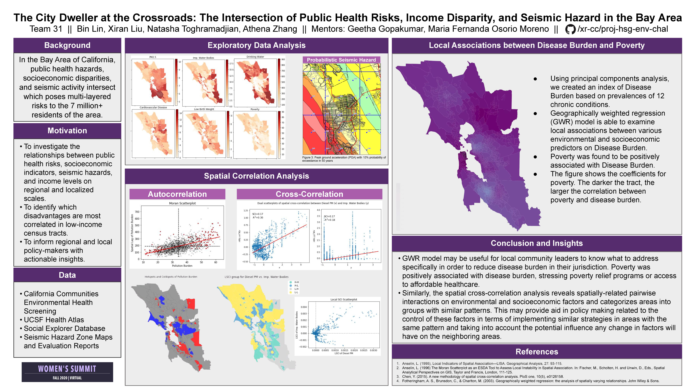

# The City-Dweller at the Crossroads: The Intersection of Public Health Risks, Income Disparity, and Seismic Hazard in the Bay Area
__This is the team project for DS4A: Women's Summit (FL2020), Team 31__

_Team Members: Bin Lin, Xiran Liu, Natasha Toghramadjian, Athena Zhang_

_Project Mentors: Geetha Gopakumar, Maria Fernanda Osorio Moreno_

## Project Outline
> People in real life are simultaneously exposed to multiple contaminants from multiple sources and also have multiple stressors based on their health status as well as living conditions. Thus, the resulting cumulative health risk is also often influenced by non-chemical factors such as socioeconomic and health status of the people living in a community.
> - California Environmental Screening Report, January 2017

We intend to identify how relationships between public health risks and socioeconomic disadvantages vary between spatially divided communities. 

## Data Sources
* CalEnviroScreen 3.0 (limited to Bay Area): https://oehha.ca.gov/calenviroscreen/report/calenviroscreen-30 
* Income data from Social Explorer: http://socialexplorer.com
* Seismic data from the California Department of Conservation and California Geological Survey: http://conservation.ca.gov

## Poster

## Files
Code files are located under "code/". All code are in Python notebook or R.

[Here](Project_Report.pdf) is a report summarizing our motivations, problem statement, data background, methods, results and discussions.  

